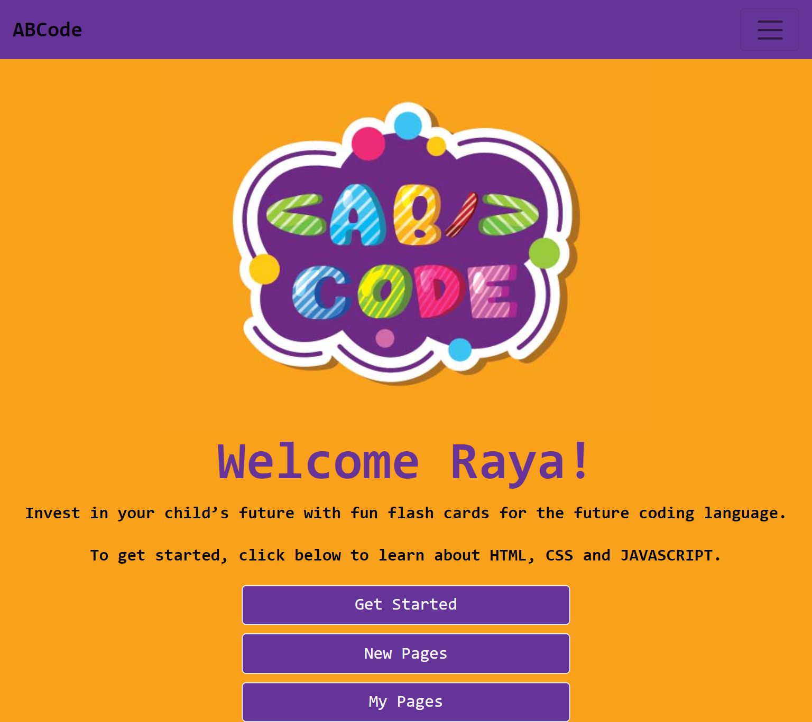
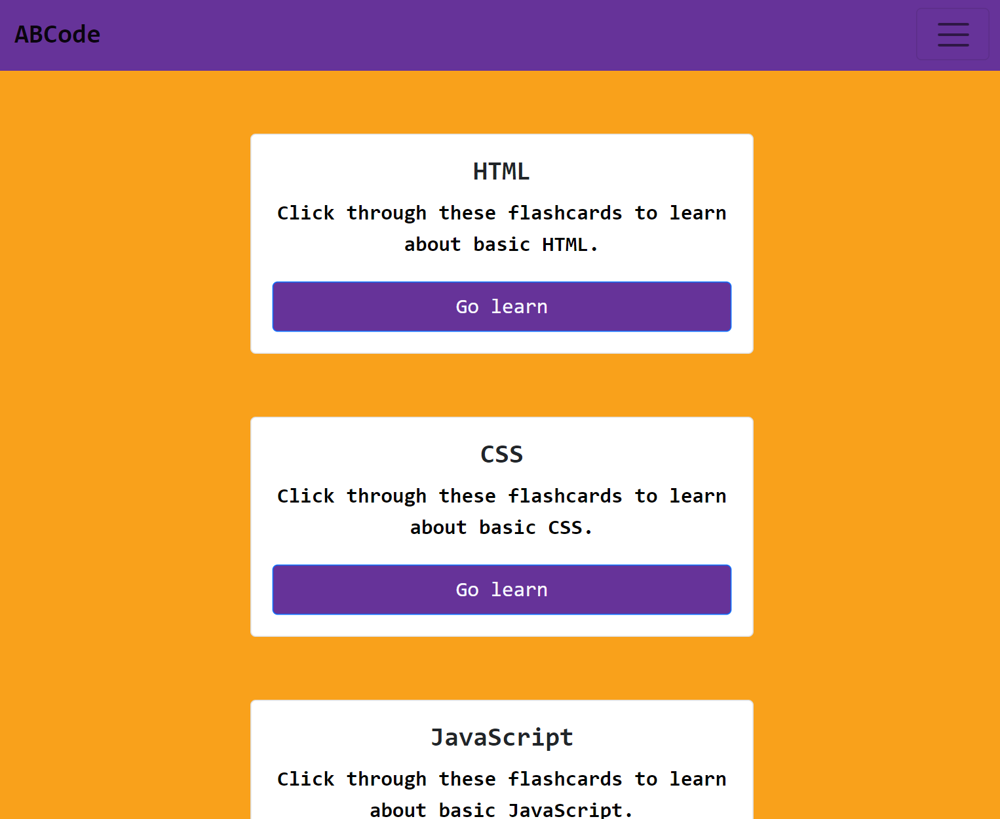
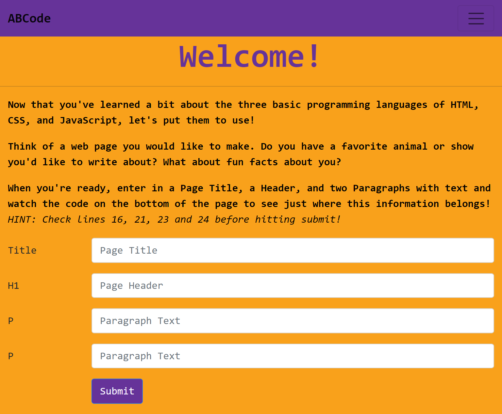
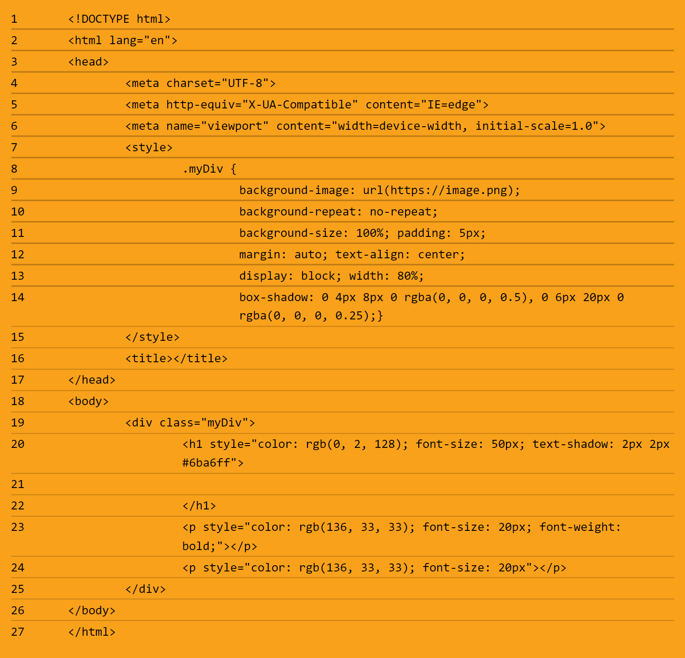

# ABCode

## Description

Welcome to our coding learning app, specifically designed to make coding fun for children to learn! It  serves as a dynamic workbook that helps children develop a basic understanding of coding concepts, starting with HTML, MadLibs style. It is a fun way for children to start getting their hands dirty with code with on-screen interactive functions. 

## Table of Contents

* [Installation](#installation)
* [Acceptance Criteria](#acceptancecriteria)
* [Usage](#usage)
* [Technologies](#technologies)
* [User Story](#User-story)
* [License](#license)
* [Questions](#questions)

## Acceptance Criteria 

```
WHEN I navigate to ABCode, 
THEN I see options to sign up, log in, or view flashcards
WHEN I choose view flashcards, 
THEN I see stacks for HTML, CSS, and JavaScript
WHEN I choose a stack, 
THEN I am presented with a definition/description on a card (one by one) with “next”  “back” and “exit” buttons
WHEN I click next, 
THEN I am presented with a different definition
WHEN I choose sign up, 
THEN I am able to make an account
WHEN I sign up or log in, 
THEN I am able to see options for “New Page” or “My Pages” in the nav bar 
WHEN I select New Page
THEN I am presented with a form in which I can input information that I want on my web page and see a code snippet along the bottom
WHEN I enter in information to the form, 
THEN I see my input dynamically appear in the code snippet below in the correct locations
WHEN I select “See My Page” 
THEN I am redirected to a web page with basic styling that includes the content I entered on the “New Page” tab
WHEN I select “My Pages,” 
THEN I see buttons for each of the pages I have created within my account 
WHEN I log out, 
THEN I am redirected to the home page 

```

## Installation

If you would like to install the application, please follow the steps listed below: 


1. Clone repository from the github repository, which can be found here: https://github.com/bridgettequiambao/ABCode

2. npm install

3. npm run develop

## Usage

The live app: https://abcode-zl-21.herokuapp.com/

A screenshot of the project 




## Technologies

Technologies

* CSS
* JAVASCRIPT
* HTML
* GRAPHQL
* MongoDB/Mongoose


## User Story
```
As a user, I want to read about basic implementation of HTML, 
As a user, I want to be able to practice and see what I read about, 
As a user, I want to be able to render an HTML page by using a blank style form with a view of the code snippet.
As a user, I want to be able to save previous pages created.
As a user, I want to be able to know where I can further my learning after using the app/find helpful links.


```

## Contributors

* Erica Snyder 
* Raghad Malallah
* Zack Lai 
* Bridgette Quiambao


## License 

MIT License

Permission is hereby granted, free of charge, to any person obtaining a copy
of this software and associated documentation files (the "Software"), to deal
in the Software without restriction, including without limitation the rights
to use, copy, modify, merge, publish, distribute, sublicense, and/or sell
copies of the Software, and to permit persons to whom the Software is
furnished to do so, subject to the following conditions:

The above copyright notice and this permission notice shall be included in all
copies or substantial portions of the Software.

THE SOFTWARE IS PROVIDED "AS IS", WITHOUT WARRANTY OF ANY KIND, EXPRESS OR
IMPLIED, INCLUDING BUT NOT LIMITED TO THE WARRANTIES OF MERCHANTABILITY,
FITNESS FOR A PARTICULAR PURPOSE AND NONINFRINGEMENT. IN NO EVENT SHALL THE
AUTHORS OR COPYRIGHT HOLDERS BE LIABLE FOR ANY CLAIM, DAMAGES OR OTHER
LIABILITY, WHETHER IN AN ACTION OF CONTRACT, TORT OR OTHERWISE, ARISING FROM,
OUT OF OR IN CONNECTION WITH THE SOFTWARE OR THE USE OR OTHER DEALINGS IN THE
SOFTWARE.

## Questions

If you have questions or you want to share comments, we will be glad to hear from you. Please contact me at